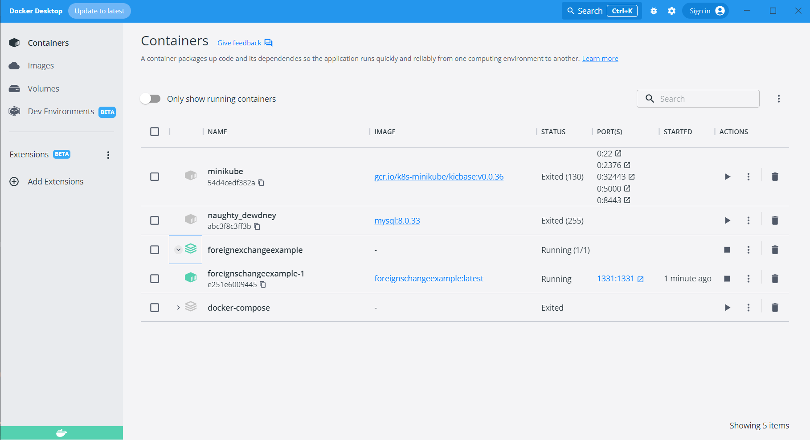

# Case Study - Foreign Exchange Example

<p align="center">
    
</p>

### 📖 Information

<ul style="list-style-type:disc">
  <li>This project demonstrates a <b>Spring Boot</b> application for managing foreign exchange operations. It allows users to convert currencies, retrieve current exchange rates, and view conversion history.</li>
  <li>The application integrates with an external service provider for fetching exchange rates and performing currency conversion calculations.</li>
  <li>The application includes three main endpoints:
    <ul>
      <li>Exchange Rate Endpoint: Fetches the current exchange rate between two currencies.</li>
      <li>Currency Conversion Endpoint: Converts a given amount from one currency to another and returns a unique transaction identifier.</li>
      <li>Conversion History Endpoint: Retrieves the history of currency conversions based on transaction identifiers or dates.</li>
    </ul>
  </li>
</ul>


### Explore Rest APIs

Endpoints Summary

<table style="width:100%">
  <tr>
      <th>Method</th>
      <th>Url</th>
      <th>Description</th>
      <th>Request Body</th>
      <th>Path Variable</th>
      <th>Response</th>
  </tr>
  <tr>
      <td>POST</td>
      <td>/api/v1/exchange-rate</td>
      <td>Fetches the current exchange rate between two currencies.</td>
      <td>ExchangeRateRequest</td>
      <td>None</td>
      <td>ExchangeRateResponse</td>
  </tr>
  <tr>
      <td>POST</td>
      <td>/api/v1/convert</td>
      <td>Converts currency based on the provided ConvertRequest.</td>
      <td>ConvertRequest</td>
      <td>None</td>
      <td>ConvertResponse</td>
  </tr>
  <tr>
      <td>POST</td>
      <td>/api/v1/history</td>
      <td>Retrieves the conversion history based on the provided ConversionHistoryFilterRequest.</td>
      <td>ConversionHistoryFilterRequest</td>
      <td>None</td>
      <td>CustomPage&lt;ConvertHistoryResponse&gt;</td>
  </tr>
</table>


### Technologies

---
- Java 21
- Spring Boot 3.0
- Restful API
- Mapstruct
- Open Api (Swagger)
- Maven
- Junit5
- Mockito
- Integration Tests
- Docker
- Docker Compose
- CI/CD (Github Actions)
- Postman
- H2 Database (In-Memory)

### Postman

```
Import postman collection under postman_collection folder
```


### Prerequisites

#### Define Variable in .env file for http://api.currencylayer.com/

```
EXCHANGE_API_API_KEY={EXCHANGE_API_API_KEY}
```

### Open Api (Swagger)

```
http://localhost:1331/swagger-ui/index.html
```

---
- Maven or Docker
---


### Docker Run
The application can be built and run by the `Docker` engine. The `Dockerfile` has multistage build, so you do not need to build and run separately.

Please follow directions shown below in order to build and run the application with Docker Compose file;

```sh
$ cd foreignexchangeexample
$ docker-compose up -d
```

If you change anything in the project and run it on Docker, you can also use this command shown below

```sh
$ cd foreignexchangeexample
$ docker-compose up --build
```

---
### Maven Run
To build and run the application with `Maven`, please follow the directions shown below;

```sh
$ cd foreignexchangeexample
$ mvn clean install
$ mvn spring-boot:run
```

---
### Docker Image Location

```
https://hub.docker.com/repository/docker/noyandocker/foreignexchangeexample/general
```

### Screenshots

<details>
<summary>Click here to show the screenshots of project</summary>
    <p> Figure 1 </p>
    
    <p> Figure 2 </p>
    
    <p> Figure 3 </p>
    
    <p> Figure 4 </p>
    
    <p> Figure 5 </p>
    
    <p> Figure 6 </p>
    
    <p> Figure 7 </p>
    
    <p> Figure 8 </p>
    
</details>


### Contributors

- [Sercan Noyan Germiyanoğlu](https://github.com/Rapter1990)